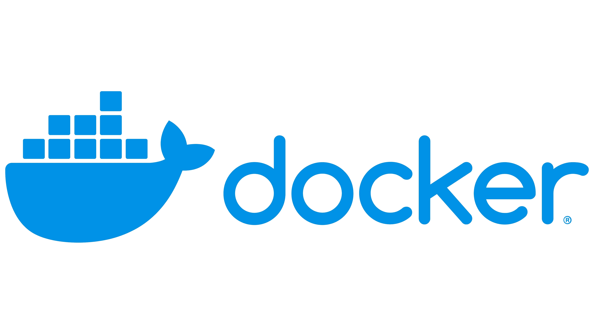

# INTRODUCTION TO DOCKER

**Namespaces** are Linux kernel feature that provides the ability to expose different "views" of your system to applications running within it.

**Control groups**, another Linux kernel feature build on this by providing the ability to restrict how much hardware each process can use.

+ **Container**  
+ **Image** : compressed and pre-packaged file sytem that contains your app along with its environment and configuration with an instructiont to how to start your app.
+ **Volumes** hold the data of our containers.  
+ **Networking** connects them all items.  

### You can learn anything about Docker commands:

    docker --help

### Docker command structure is generally like this:
    docker <top-command> <sub-command> --<options>

Docker creates an image for every command in our **Dockerfile**.
Docker images are just layered images compressed together. These are called intermediate images.

### You can create the image with docker build **&lt;image name&gt;**
    docker build -t serhank/image-name . 

### We can list all images we have created
    docker images

## We can remove images
    docker rmi <image id>

**.dockerignore** : is the file you describe what you don't include in the container  

### This creates containers but does not start them:
    docker container create hello-world:linux  

### To start the container and attach to the terminal:    
    docker container start <container-id> 
    docker container attach <container-id>  
    docker container start --attach <container-id>   

### To see the logs of container:
    docker logs <container-id>

## docker run
* It creates, starts and attach the terminal to the container.
* Docker containers are not interactive by default.

### With -d docker run will not attach to the terminal
    docker run -d <image-name>
### We can name the containers
    docker run -d <image-name> --name <container-name> 

### Running additional commands in contaier:
    docker exec <container-id> date
    docker exec --interactive --tty <container-id> bash 
    
    CTRL+D to exit out of shell.

Docker provides the ability to access newtwork ports within the container, with something called port binding. This feature allows docker to take a port on your machine an map it to a port within the container.

### Use -p parameter to bind our machine-port:container-port

    // -p  outer:inner
    docker run -p 4000:4000 serhank/simple-backend

### --rm parameter means: "remove immediately after it worked"
    docker run --rm --entrypoint sh ubuntu -c "echo 'Hello there' > /tmp/fi&& cat /tmp/file " 

**Volume mounting** feature of Docker allows Docker to map a folder on host computer to a folder in the container. (with -v --v)

    docker run --rm --entrypoint sh -v /tmp/container:/tmp ubuntu  -c "echo 'Hello there' > /tmp/fi&& cat /tmp/file " 

### We can list the containers:
    // ...that are actively running.
    docker ps
    // ..., all of them.
    docker ps --all

### We can stop the container
    // slow
    docker stop <container-id>
    
    // to immediately stop
    docker stop -t 0 <container id>

    // to kill kill kill
    docker kill <container id> 

### We can delete the container
    docker rm <container-id>

### We can forcefully stop and delete the container (-f parameter)
    docker rm -f <container name> 

### To list only ids 
    docker ps -aq 
### To remove all containers
    docker ps -aq | xargs docker rm

##  DOCKER HUB
----
### To login
    docker login

### To rename docker images
    docker tag <image-name> <username/new-name:0.0.1>

### To push an image to docker hub
    docker push <name-of-the-image>

### To pull an image from docker hub
    docker pull <name of the image>

## [Docker command line reference](https://docs.docker.com/engine/reference/commandline/docker/)

**COMPOSE**
==
Compose is a tool that allows you to manage multiple containers. We define the containers in a .yml file.

### To build 
    docker-compose build

### -d <container name> to run first in order 
    docker-compose up -d mongo

### To see logs produced
    docker logs <container id>

### Stop all containers
    docker-compose stop

**SWARM**
===
Swarm is a tool for Docker and it is enabled by default.
It allows to manage cluster of nodes.

### To start a swarm
    docker swarm init

### To list the nodes 
    docker node ls

    docker stack deploy -c docker-compose.yml <name-of-the stack>

###  To add services to swarm 
Replicas is the number of services you want to create or available
    docker service create --replicas 1 --name nodeserver2 node ping docker.com

* **minikube** is local Kubernetes, to learn and develop for Kubernetes
* **Travis** is a CI provider

# An Example Docker File Structure
<pre>
FROM ubuntu
LABEL maintainer="Serhan Kars"
USER root ==> tells Docker which user to use for any Docker file commands underneath it by default Docker would use root user

COPY ./entrypoint.bash / => Copies files from a directory provided to the Docker build command to the container image.
The directory provided to Docker build is called the context. The context is usually the working directory.

// Run statements are the commands that customize our image.
RUN apt -y update
RUN apat -y install curl bash
RUN chmod 755 /entrypoint.bash

USER nobody => the user command to set the default users for containers created from this image to the powerless nobody user.
This ensures that we can't break out of the container and potentially change importan files on our host.

ENTRYPOINT ["/entrypoint.bash"] Tells docker what command containers created from this image should run. CMD command can be used as well.

</pre>

# DOCKER TROUBLESHOOT

    docker images  
    docker rmi  <image1> <image2> <image3>

### Can not create more containers: "No space left on device:unknown"
--- 
### To remove all unused entities
    docker system prune 

## Container is really slow
---
### To see resource usage of containers
    docker stats <container-name>
    docker exec -i -t <container-name> sh
### To see what is running inside the container
    docker top
### To get info in JSON format about a container
    docker inspect <container-name>
